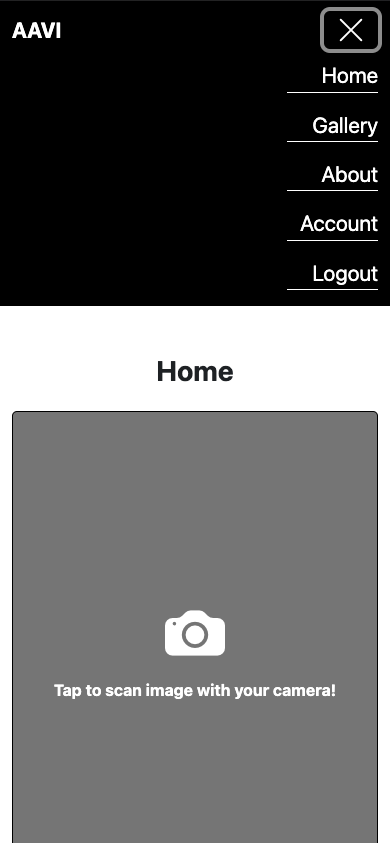
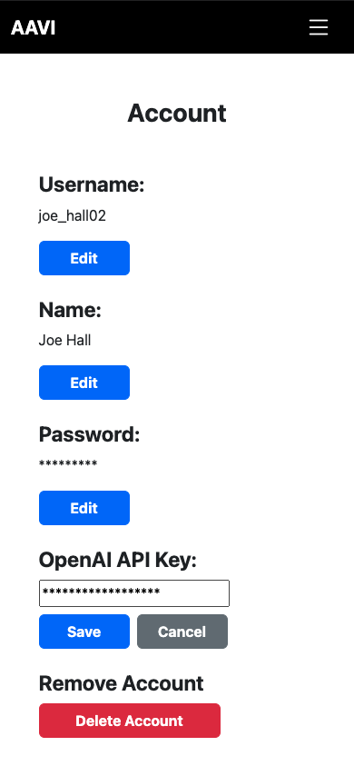
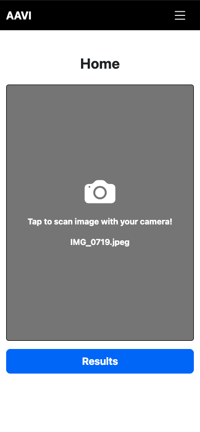
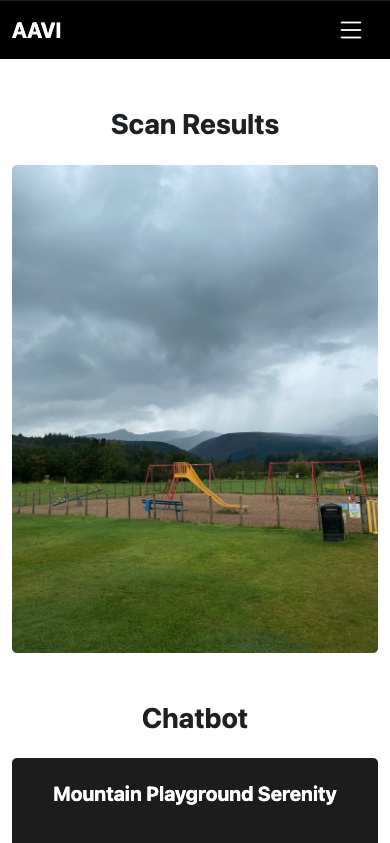
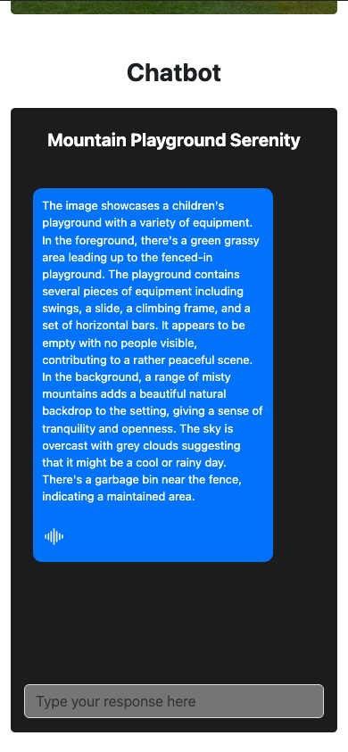
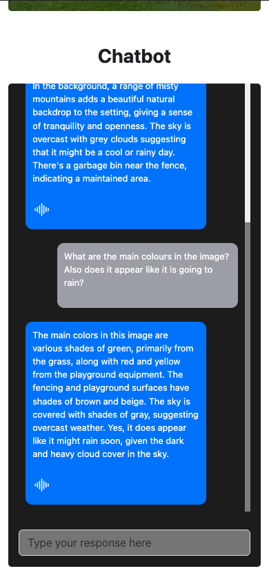

## 1. Table of Contents

- [1. Table of Contents](#1-table-of-contents)
- [2. About The Project](#2-about-the-project)
    - [2.1. Submission Title](#21-submission-title)
    - [2.2. Developer Names](#22-developer-names)
    - [2.3. Release Notes](#23-release-notes)
    - [2.4. Built With](#24-built-with)
- [3. Getting Setup](#3-getting-setup)
    - [3.1. Prerequisites](#31-prerequisites)
    - [3.2. Installation](#32-installation)
- [4. Usage](#4-usage)
- [5. Roadmap](#5-roadmap)
- [6. Acknowledgements](#6-acknowledgements)

## 2. About The Project

### 2.1. Submission Title

AI Assistant for the Visually Impaired

### 2.2. Developer Names

Joe Hall

### 2.3. Release Notes

This is my submission for my final year university project. I was asked to identify a computer-based problem that I would be interested in solving, this project is my answer to the problem of limited accessibility for blind and visually impaired people.

### 2.4. Built With

- React
- Flask Web Framework
- Python
- HTML/CSS
- JavaScript
- SQLite

## 3. Getting Setup

### 3.1. Prerequisites

- React and npm
- Python 3 and pip
- Visual Studio Code (or similar code editor)

### 3.2. Installation

#### Clone the GitHub repo onto your machine

#### Cd into the backend directory
- cd backend/

#### Run the virtual environment
- pipenv shell

#### Run the following command to install packages
- pip install -r requirements.txt

#### Run the backend (flask app will be running on port 5000)
- python3 run.py

#### Cd into client directory
- cd client/

#### Run the following command to install dependancies
- npm install

#### Run the frontend (react app will be running on port 3000)
- npm start

## 4. Usage

### Step 1: Enter valid OpenAI API key

### Step 2: Scan image using your camera or upload an image

### Step 3: Talk to the chatbot!

## 5. Roadmap

So far I have developed the main functionalities that I intended to develop over the course of this project. However, in the future I would like to add support for users to be able to interact with each other by sharing their scanned images. I would also like to move the the application to a cloud hosting provider to allow for scalability of my deliverable.

## 6. Acknowledgements

- [React Documentation](https://react.dev/)
- [Flask API Documentation](https://flask.palletsprojects.com/en/2.3.x/api/)
- [OpenAI API Documentation](https://platform.openai.com/docs/overview)
- [Bootstrap Documentation](https://getbootstrap.com/docs/5.0/getting-started/introduction/)
